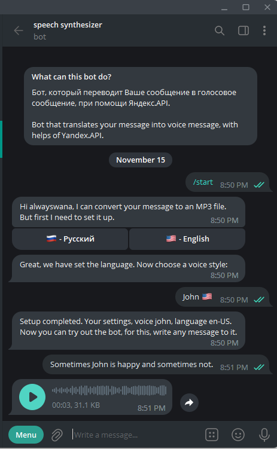

# university-tg-speech-bot

## Telegram bot which can convert you message to voice.

### Technology:
    1. Kotlin
    2. Spring Boot
    3. PostgreSQL
    4. Yandex Cloud API

### For start:
1. Run all from `docker-compose.yaml`
2. Insert your tokens to config `application.yaml`

### Preview:

